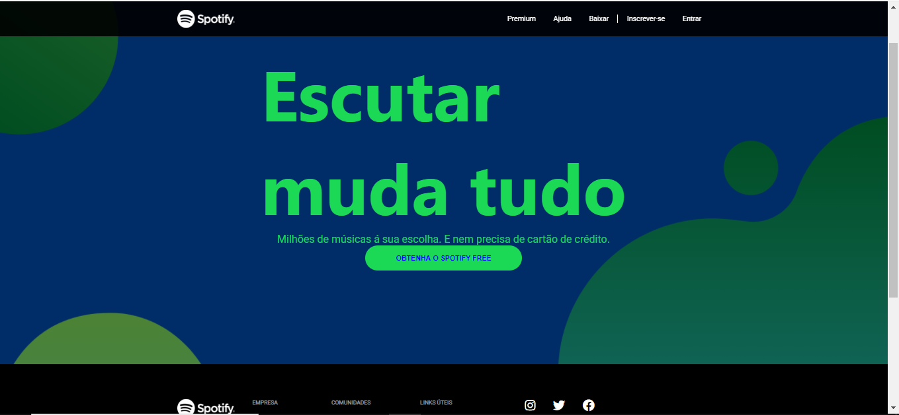

## Clone doo spotify

#### Visão geral do projeto! 

Spotify é uma plataforma de músicas, onde você pode ouvir offiline e online.

### Finalidade do projeto:

Por em prática o venho aprendendo nos ultimos dias;

Tecnlogias utilizadas:

- HTML;
- CSS;
- JavaScript;

